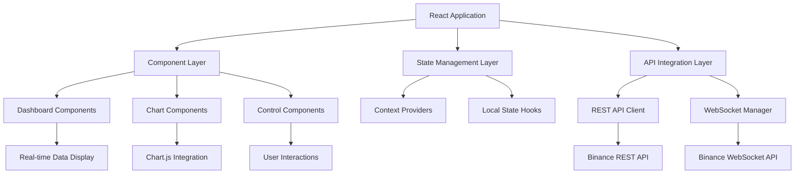
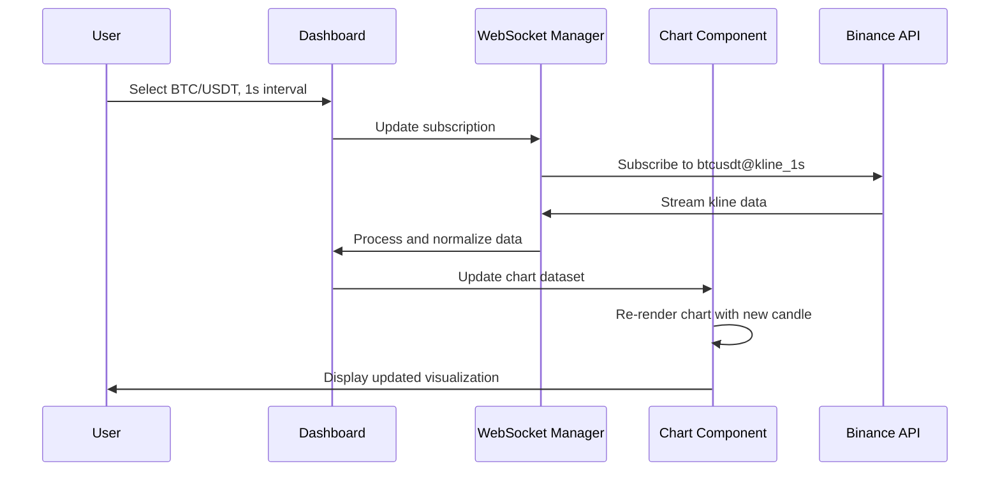
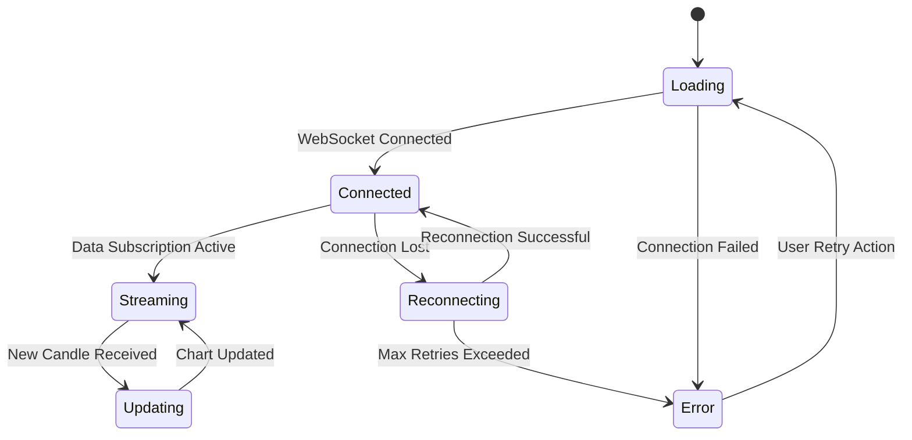
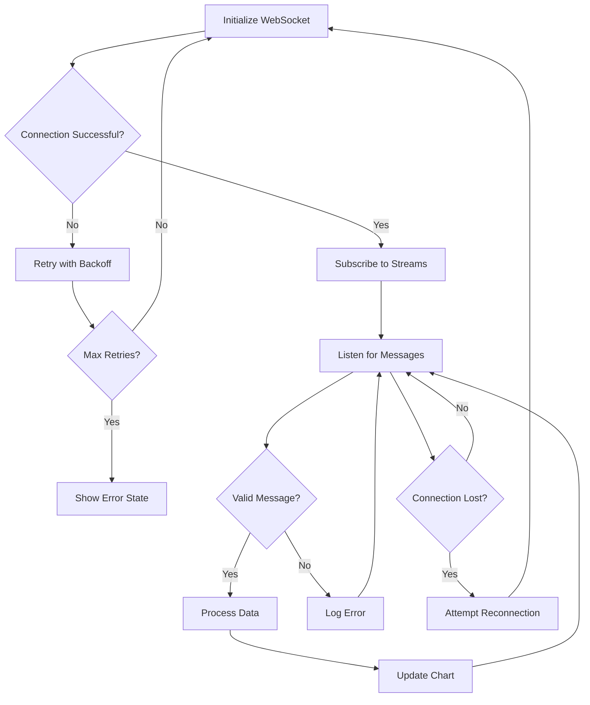

# Crypto Chart Dashboard - Design Document

## Overview

The Crypto Chart Dashboard is a React-based web application that provides real-time cryptocurrency price visualization through interactive candlestick and line charts. The application leverages Binance's REST and WebSocket APIs to deliver live market data updates, focusing on BTC/USDT and ETH/USDT trading pairs with multiple timeframe options.

### Core Value Proposition
- Real-time cryptocurrency price tracking without third-party chart dependencies
- Seamless integration with Binance market data streams
- Responsive design optimized for both desktop and mobile viewing
- Zero-configuration deployment capability for modern hosting platforms

### Target Users
- Cryptocurrency traders requiring real-time price monitoring
- Financial analysts tracking market movements
- Developers seeking a reference implementation for crypto data visualization

## Technology Stack & Dependencies

### Core Framework
- **React 18+**: Component-based UI framework with hooks for state management
- **TypeScript**: Type-safe development environment
- **Vite**: Fast build tool and development server

### Charting & Visualization
- **Chart.js**: Canvas-based charting library for performance optimization
- **chartjs-chart-financial**: Financial chart plugin providing candlestick chart capabilities
- **chartjs-adapter-date-fns**: Time scale adapter for proper timestamp handling

### Styling & UI
- **Tailwind CSS**: Utility-first CSS framework for responsive design
- **Headless UI**: Accessible, unstyled UI components
- **React Icons**: Comprehensive icon library

### API & Data Management
- **Axios**: HTTP client for REST API interactions
- **Native WebSocket API**: Direct browser WebSocket implementation
- **React Query**: Server state management and caching

## Component Architecture

### Component Hierarchy

```
App
├── Layout
│   ├── Header
│   │   ├── Logo
│   │   └── ThemeToggle
│   └── Footer
├── Dashboard
│   ├── ControlPanel
│   │   ├── PairSelector
│   │   ├── IntervalSelector
│   │   └── ChartTypeToggle
│   ├── ChartContainer
│   │   ├── PriceChart
│   │   └── LoadingSpinner
│   └── MarketInfo
│       ├── PriceDisplay
│       ├── VolumeDisplay
│       └── ChangeIndicator
└── ErrorBoundary
```

### Component Definitions

#### App Component
- **Purpose**: Root application component managing global state and routing
- **State**: Theme preference, WebSocket connection status
- **Responsibilities**: Error boundary setup, theme provider initialization

#### Dashboard Component
- **Purpose**: Main container orchestrating chart display and controls
- **State**: Selected trading pair, timeframe interval, chart type preference
- **Props**: None (root dashboard component)
- **Lifecycle**: Manages WebSocket connections and data subscriptions

#### ControlPanel Component
- **Purpose**: User interface controls for chart customization
- **State**: Form validation states for selector components
- **Props**: 
  - `selectedPair`: Current trading pair
  - `selectedInterval`: Current timeframe
  - `onPairChange`: Callback for pair selection
  - `onIntervalChange`: Callback for interval selection

#### PriceChart Component
- **Purpose**: Chart.js integration component for price visualization
- **State**: Chart instance reference, dataset configuration
- **Props**:
  - `data`: Candlestick data array
  - `chartType`: 'candlestick' | 'line'
  - `isLoading`: Loading state indicator
- **Lifecycle**: Chart initialization on mount, data updates on prop changes

#### PairSelector Component
- **Purpose**: Dropdown interface for trading pair selection
- **State**: Dropdown open/closed state
- **Props**:
  - `selectedPair`: Currently selected trading pair
  - `availablePairs`: Array of supported trading pairs
  - `onChange`: Selection change callback

#### IntervalSelector Component
- **Purpose**: Time interval selection interface
- **State**: Active interval highlighting
- **Props**:
  - `selectedInterval`: Current timeframe
  - `availableIntervals`: Supported time intervals
  - `onChange`: Interval change callback

#### MarketInfo Component
- **Purpose**: Real-time market statistics display
- **State**: Animation states for price changes
- **Props**:
  - `currentPrice`: Latest price value
  - `priceChange`: 24h price change percentage
  - `volume`: 24h trading volume

### State Management Strategy

#### Global State (Context API)
- **WebSocketContext**: Manages WebSocket connections and real-time data streams
- **ChartDataContext**: Centralized candlestick data management
- **UserPreferencesContext**: Theme, default pair, and interval preferences

#### Local Component State
- **UI State**: Form inputs, modal visibility, loading indicators
- **Chart State**: Chart.js instance references, zoom levels, display options
- **Animation State**: Transition states for price change indicators

### Props Interface Design

```typescript
interface TradingPair {
  symbol: string;
  baseAsset: string;
  quoteAsset: string;
  displayName: string;
}

interface CandlestickData {
  timestamp: number;
  open: number;
  high: number;
  low: number;
  close: number;
  volume: number;
}

interface ChartProps {
  data: CandlestickData[];
  chartType: 'candlestick' | 'line';
  isLoading: boolean;
  onZoomChange?: (zoomLevel: number) => void;
}
```

## API Integration Layer

### Binance REST API Integration

#### Historical Data Endpoint
- **Endpoint**: `GET /api/v3/klines`
- **Purpose**: Fetch initial 200 candlesticks for chart initialization
- **Parameters**:
  - `symbol`: Trading pair identifier (BTCUSDT, ETHUSDT)
  - `interval`: Timeframe (1s, 5s, 1m, 5m, 15m, 1h, 4h, 1d)
  - `limit`: Number of candles (200)
- **Response Processing**: Transform timestamp and price strings to numbers
- **Error Handling**: Retry logic with exponential backoff, fallback to cached data

#### Market Statistics Endpoint
- **Endpoint**: `GET /api/v3/ticker/24hr`
- **Purpose**: Retrieve 24-hour price change statistics
- **Parameters**: `symbol` for specific trading pair data
- **Update Frequency**: Every 30 seconds via polling

### Binance WebSocket Integration

#### Stream Configuration
- **Base URL**: `wss://stream.binance.com:9443/ws/`
- **Stream Format**: `{symbol}@kline_{interval}`
- **Supported Pairs**: BTC/USDT, ETH/USDT
- **Supported Intervals**: 1s, 5s

#### Connection Management
- **Auto-reconnection**: Exponential backoff strategy for connection failures
- **Heartbeat Monitoring**: Ping/pong mechanism to detect connection health
- **Subscription Management**: Dynamic subscription changes based on user selections
- **Buffer Management**: Temporary storage during connection interruptions

#### Data Processing Pipeline
1. **Raw Message Parsing**: JSON deserialization of WebSocket messages
2. **Data Validation**: Type checking and range validation for price data
3. **Timestamp Normalization**: Convert Binance timestamps to JavaScript Date objects
4. **Chart Data Integration**: Merge new candles with existing dataset
5. **UI Update Triggering**: Notify chart components of data changes

#### WebSocket Message Format
```typescript
interface BinanceKlineMessage {
  e: 'kline';          // Event type
  E: number;           // Event time
  s: string;           // Symbol
  k: {
    t: number;         // Kline start time
    T: number;         // Kline close time
    s: string;         // Symbol
    i: string;         // Interval
    f: number;         // First trade ID
    L: number;         // Last trade ID
    o: string;         // Open price
    c: string;         // Close price
    h: string;         // High price
    l: string;         // Low price
    v: string;         // Base asset volume
    n: number;         // Number of trades
    x: boolean;        // Is this kline closed?
    q: string;         // Quote asset volume
    V: string;         // Taker buy base asset volume
    Q: string;         // Taker buy quote asset volume
  };
}
```

## Routing & Navigation

### Route Structure
- **Primary Route**: `/` - Main dashboard view
- **No Additional Routes**: Single-page application with component-based navigation

### Navigation Strategy
- **State-based Navigation**: Component visibility controlled by application state
- **Browser History**: URL parameters for trading pair and interval persistence
- **Deep Linking**: Support for direct links to specific pair/interval combinations

### URL Parameter Schema
- **Base URL**: `/{pair}/{interval}`
- **Examples**: 
  - `/BTCUSDT/1s` - Bitcoin 1-second chart
  - `/ETHUSDT/5s` - Ethereum 5-second chart
- **Default Fallback**: `/BTCUSDT/1s` when no parameters provided

## Styling Strategy

### Tailwind CSS Implementation
- **Configuration**: Custom color palette reflecting financial data visualization
- **Responsive Breakpoints**: Mobile-first approach with tablet and desktop optimizations
- **Component Classes**: Utility composition for consistent spacing and typography
- **Dark Mode Support**: CSS variable-based theme switching

### Design System Components

#### Color Palette
- **Primary Colors**: Blue gradient for positive price movements
- **Secondary Colors**: Red gradient for negative price movements
- **Neutral Colors**: Gray scale for text, borders, and backgrounds
- **Accent Colors**: Yellow for highlights and important information

#### Typography Scale
- **Headings**: Inter font family with weight variations (400, 500, 600, 700)
- **Body Text**: 14px base size with 1.5 line height for readability
- **Monospace**: JetBrains Mono for price displays and numerical data

#### Spacing System
- **Base Unit**: 4px increments for consistent spacing
- **Component Padding**: 12px, 16px, 24px for different component sizes
- **Margin Classes**: Systematic spacing between chart elements

### Responsive Design Strategy
- **Mobile (320px-768px)**: Single-column layout with stacked controls
- **Tablet (768px-1024px)**: Two-column layout with sidebar controls
- **Desktop (1024px+)**: Full-width chart with horizontal control panel

## Testing Strategy

### Unit Testing Framework
- **Jest**: JavaScript testing framework with snapshot capabilities
- **React Testing Library**: Component testing with user-centric assertions
- **Mock Service Worker**: API mocking for isolated component testing

### Test Coverage Areas

#### Component Testing
- **Rendering Tests**: Verify component output with various prop combinations
- **Interaction Tests**: User event simulation (clicks, form inputs, keyboard navigation)
- **State Management**: Context provider testing and state updates
- **Error Boundaries**: Error handling and recovery testing

#### Integration Testing
- **API Integration**: Mock WebSocket and REST API responses
- **Chart Functionality**: Chart.js integration and data visualization
- **User Workflows**: Complete user journey testing (pair selection, interval changes)

#### Performance Testing
- **WebSocket Load**: Connection stability under rapid message frequency
- **Chart Rendering**: Performance monitoring for large datasets
- **Memory Management**: Memory leak detection during extended usage

### Testing Utilities
- **Custom Render Functions**: Wrapper functions with context providers
- **Mock Data Generators**: Realistic candlestick data for testing
- **WebSocket Mocking**: Simulated real-time data streams

#### Example Test Structure
``typescript
describe('PriceChart Component', () => {
  it('renders candlestick chart with provided data', () => {
    // Test implementation
  });
  
  it('updates chart when new data arrives', () => {
    // Test implementation
  });
  
  it('handles WebSocket connection errors gracefully', () => {
    // Test implementation
  });
});
```

## Architecture Diagrams

### System Architecture Overview



### Data Flow Architecture



### Component State Flow



### WebSocket Connection Management



## Performance Considerations

### Chart Rendering Optimization
- **Canvas-based Rendering**: Chart.js utilizes HTML5 Canvas for efficient drawing operations
- **Data Point Limiting**: Maximum 500 visible candles to maintain smooth animations
- **Update Throttling**: Batch WebSocket updates to prevent excessive re-renders
- **Memory Management**: Automatic cleanup of old chart data beyond retention window

### WebSocket Performance
- **Connection Pooling**: Single WebSocket connection for multiple data streams
- **Message Buffering**: Queue messages during temporary processing delays
- **Selective Updates**: Only update chart when candle data actually changes
- **Compression**: Enable WebSocket compression for reduced bandwidth usage

### Bundle Optimization
- **Code Splitting**: Lazy load chart components for faster initial page load
- **Tree Shaking**: Remove unused Chart.js features and plugins
- **Asset Optimization**: Compress and optimize icon assets
- **CDN Integration**: Leverage CDN for Chart.js library delivery

### Responsive Performance
- **Chart Resizing**: Debounced resize handlers for smooth responsive behavior
- **Mobile Optimization**: Touch-optimized chart interactions
- **Reduced Animation**: Simplified animations on lower-performance devices
- **Progressive Enhancement**: Core functionality works without JavaScript
